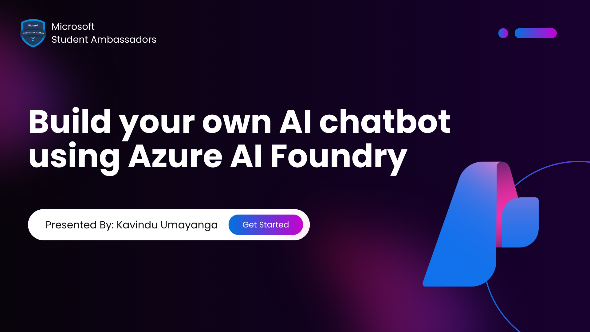

# Build Your Own AI Chatbot with Microsoft Foundry

This repository contains a simple demo created after the session  
**“Build Your Own AI Chatbot with Microsoft Foundry”**, conducted as part of the **Microsoft Student Ambassador** community.

The session introduces Microsoft Foundry and demonstrates how to build, test, and integrate an AI chatbot using custom data and a simple web interface.



---

## 🎥 Session Recording (Watch the Demo)

If you missed the live session or want to follow the demo step by step, you can watch the full session recording here:

👉 [Watch the session recording](https://stdntpartners-my.sharepoint.com/:v:/g/personal/kavindu_umayanga_studentambassadors_com/IQCuS4z6ExFUS5odLza2gHn9AUnYr3b-TWuUj8O_y1kjDgE?nav=eyJyZWZlcnJhbEluZm8iOnsicmVmZXJyYWxBcHAiOiJPbmVEcml2ZUZvckJ1c2luZXNzIiwicmVmZXJyYWxBcHBQbGF0Zm9ybSI6IldlYiIsInJlZmVycmFsTW9kZSI6InZpZXciLCJyZWZlcnJhbFZpZXciOiJNeUZpbGVzTGlua0NvcHkifX0&e=DeuXFh)


### This recording covers:
- What is **Microsoft Foundry** and why it matters  
- **Chatbot vs AI Agent**  
- Building a chatbot using Microsoft Foundry (live demo)  
- Adding custom data  
- **RAG (Retrieval-Augmented Generation)** basics  
- **Fine-tuning** and when to use it  
- Evaluation and detecting hallucinations  
- **AI safety and security**  
- Integrating the chatbot into an external website  
- Learning resources and student benefits  

---

## Step 01 – Getting Started with Azure AI Foundry 🚀

Start learning **Azure AI Foundry** by completing the official Microsoft learning path:

👉 **Create Custom Copilots with AI Studio**  
https://learn.microsoft.com/azure/ai-studio?wt.mc_id=studentamb_345548

This learning path helps you understand the fundamentals of Microsoft Foundry and how to build custom AI copilots.

---

## How to Get Azure Free Credit with Student Sign-Up 🎓💳

Students can get **free Azure credits** using the **Azure for Students** offer.

### Steps:
1. Visit the **Azure for Students** page  
   👉 https://azure.microsoft.com/free/students?wt.mc_id=studentamb_345548

2. Click **Activate now** and sign up using your **school or university email**

3. Verify your student status by following the on-screen instructions

4. Once verified, receive **$100 free Azure credits**

You can use these credits to explore Azure services and build your AI projects at no cost.

---


## Update Your API Details (Important)

Open `index.html` and replace the following values with **your Microsoft Foundry / Azure OpenAI deployment details**:

```html
<script>
  // Demo config (frontend-only)
  const API_KEY = "PASTE_YOUR_API_KEY_HERE";
  const MODEL_NAME = "PASTE_YOUR_DEPLOYMENT_NAME_HERE";
  const ENDPOINT = "PASTE_YOUR_ENDPOINT_HERE";
</script>

---
```
---

## Follow Me 🌐

Stay connected and follow me on social media for updates and more:

- **GitHub:** https://github.com/kavinduumayanga  
- **Facebook:** https://www.facebook.com/kavindu.umayangana.79  
- **LinkedIn:** https://www.linkedin.com/in/kavindu-umayanga-93239b319

